# Deep Dive into Creational Patterns

## Slide 1: Title Slide
### Deep Dive into Creational Patterns
#### Factory Method, Abstract Factory, Builder, Prototype, Singleton
[Ahmad Muzaki]
[Frontend Developer]
[2025]

## Slide 2: Introduction
- **What are Creational Patterns?**
  - Design patterns that deal with object creation mechanisms
  - Help make systems independent of how objects are created
  - Encapsulate knowledge about concrete classes the system uses
- **Why are they important?**
  - Flexibility in what gets created
  - How it's created
  - When it's created
  - By whom it's created

## Slide 3: Overview of Creational Patterns
- **Factory Method**: Creates objects through inheritance
- **Abstract Factory**: Creates families of related objects
- **Builder**: Constructs complex objects step by step
- **Prototype**: Creates objects by cloning existing ones
- **Singleton**: Ensures only one instance of a class exists

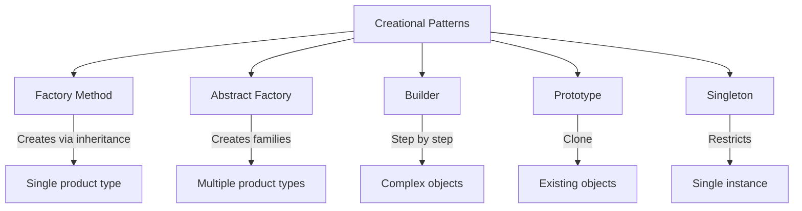

## Slide 4: Factory Method Pattern
- **Problem**: Creating objects without specifying exact class
- **Solution**: Define interface for creating objects, let subclasses decide which class to instantiate
- **Key Components**:
  - Creator (abstract class with factory method)
  - Concrete Creator (implements factory method)
  - Product interface
  - Concrete Products

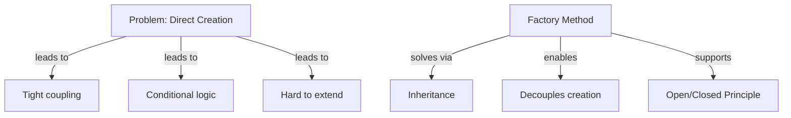

## Slide 5: Factory Method - Example
```typescript
// Abstract Product
abstract class Produce {
    // Common interfaces for all produce
    abstract getDescription(): string;
}

// Abstract Creator
export abstract class ProduceFactory {
    abstract createProduce(name: string, price: number): Produce;
    
    // Template method using the factory method
    getProduce(name: string, price: number): Produce {
        return this.createProduce(name, price);
    }
}

// Concrete Creators
export class LeafyGreenFactory extends ProduceFactory {
    createProduce(name: string, price: number): Produce {
        // Creates specific type of produce
        return new LeafyGreen(name, price);
    }
}
```

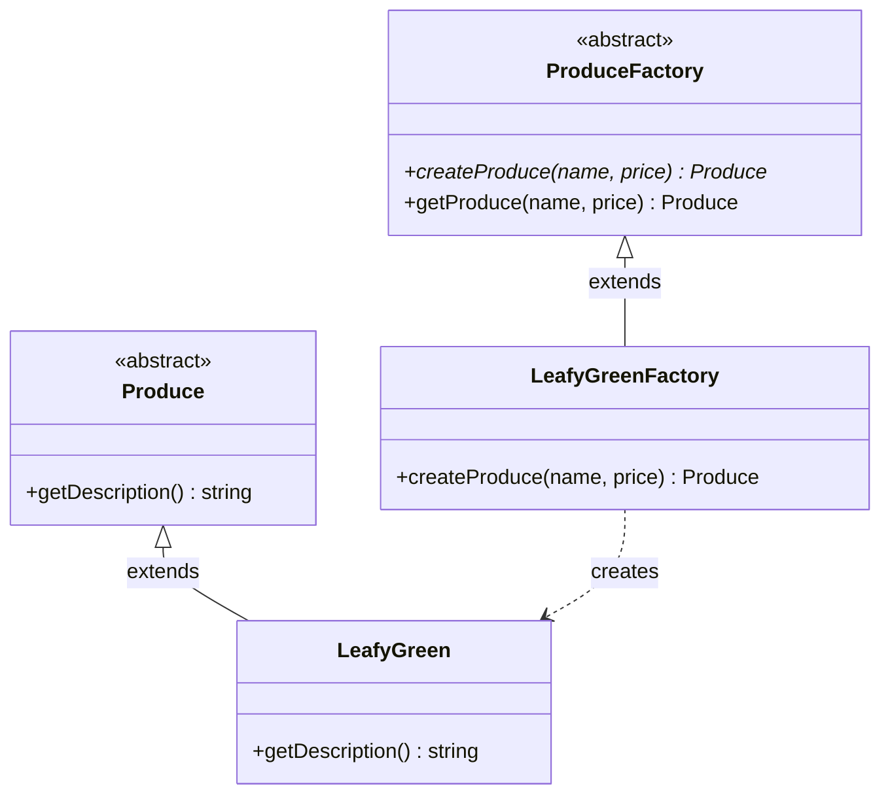

## Slide 6: Factory Method - Benefits & Use Cases
- **Benefits**:
  - Eliminates need to bind application to specific classes
  - Encapsulates object creation logic
  - Follows Open/Closed principle
- **When to Use**:
  - Class can't anticipate the type of objects it must create
  - Class wants subclasses to specify objects it creates
  - When you want to delegate responsibility to subclasses

## Slide 7: Abstract Factory Pattern
- **Problem**: Creating families of related objects
- **Solution**: Interface for creating related objects without specifying concrete classes
- **Key Components**:
  - Abstract Factory interface
  - Concrete Factories
  - Abstract Products
  - Concrete Products

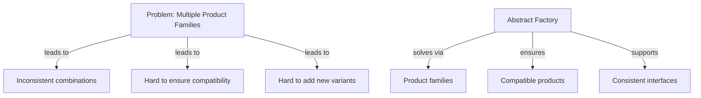

## Slide 8: Abstract Factory - Example
```typescript
// Abstract Factory interface
export interface FruitFactory {
    // Creates related products from same family
    createApple(): Apple;
    createMelon(): Melon;
    createFruitBox(): FruitBox;
    createGiftWrapping(): GiftWrapping;
}

// Concrete Factories
export class OrganicFruitFactory implements FruitFactory {
    createApple(): Apple {
        return new OrganicApple();
    }
    createMelon(): Melon {
        return new OrganicMelon();
    }
    createFruitBox(): FruitBox {
        return new OrganicFruitBox();
    }
    createGiftWrapping(): GiftWrapping {
        return new OrganicGiftWrapping();
    }
}
```

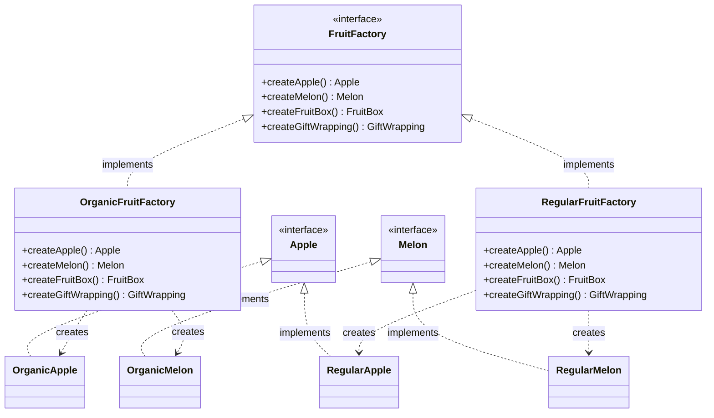

## Slide 9: Abstract Factory - Benefits & Use Cases
- **Benefits**:
  - Ensures compatibility between related products
  - Isolates concrete classes from client
  - Makes exchanging product families easy
- **When to Use**:
  - System needs to be independent of product creation
  - System should work with multiple families of related products
  - Products must be created together as a coherent set

## Slide 10: Builder Pattern
- **Problem**: Creating complex objects step by step
- **Solution**: Separate construction of complex objects from their representation
- **Key Components**:
  - Builder interface
  - Concrete Builder
  - Director (optional)
  - Product

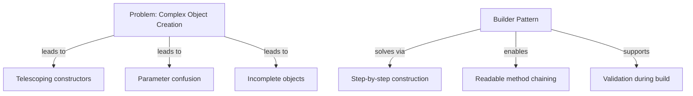

## Slide 11: Builder - Example
```typescript
// Product class with private constructor
export class ProducePackage {
  private name: string;
  private fruits: string[];
  private price: number;
  // ... other attributes

  // Private constructor - only accessible by builder
  constructor(builder: ProducePackageBuilder) {
    this.name = builder.name;
    this.fruits = builder.fruits;
    // ... other property assignments
  }

  // Static method to create a builder
  static builder(name: string): ProducePackageBuilder {
    return new ProducePackageBuilder(name);
  }
}

// Builder class with fluent interface
export class ProducePackageBuilder {
  name: string;
  fruits: string[] = [];
  price: number = 0;
  // ... other properties

  withFruits(fruits: string[]): ProducePackageBuilder {
    this.fruits = [...fruits];
    return this;
  }

  withPrice(price: number): ProducePackageBuilder {
    if (price < 0) throw new Error("Price cannot be negative");
    this.price = price;
    return this;
  }

  // Final build method with validation
  build(): ProducePackage {
    if (this.name.trim().length === 0) { // Validate the state before building
      throw new Error("Package name cannot be empty");
    }
    return new ProducePackage(this);
  }
}
```

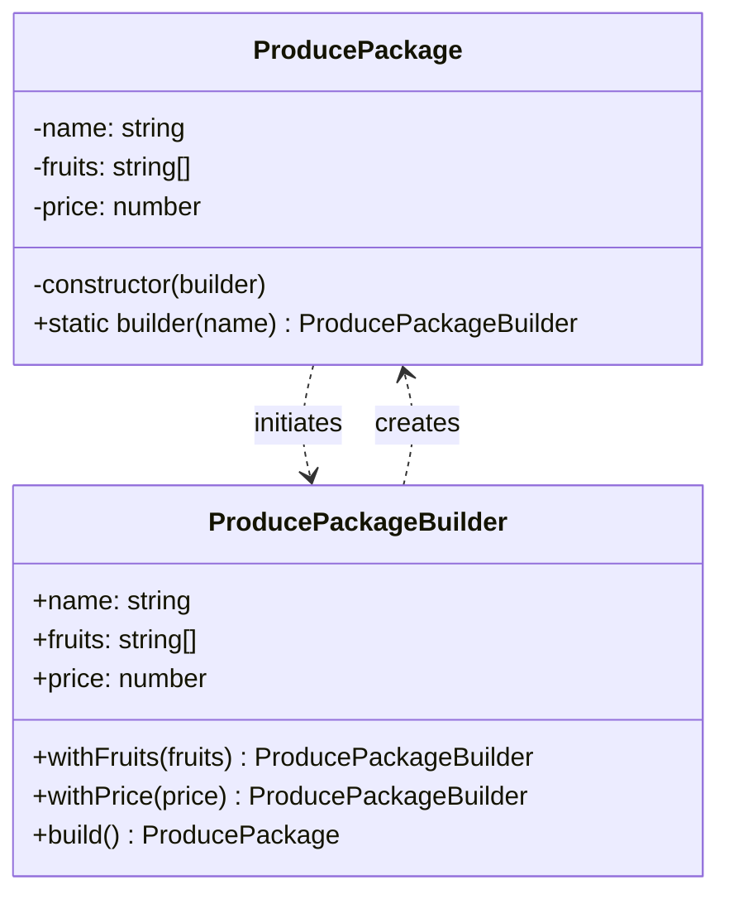

## Slide 12: Builder - Benefits & Use Cases
- **Benefits**:
  - Constructs objects step-by-step
  - Can reuse same construction code for different representations
  - Encapsulates complex construction logic
- **When to Use**:
  - Objects with complex constructors
  - Many optional parameters or configuration options
  - Need for immutable objects
  - When construction requires multiple steps

## Slide 13: Prototype Pattern
- **Problem**: Creating new objects by copying existing ones
- **Solution**: Create objects based on a template object through cloning
- **Key Components**:
  - Prototype interface (defines clone method)
  - Concrete Prototype
  - Client that creates new objects by asking prototype to clone itself

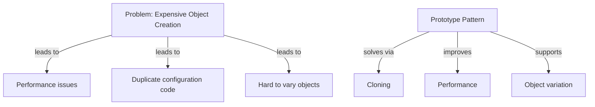

## Slide 14: Prototype - Example
```typescript
// Prototype interface
export interface Cloneable<T> {
    clone(): T;
}

// Concrete Prototype
export class ProduceBundle implements Cloneable<ProduceBundle> {
    name: string;
    items: Array<BundleItem>;
    discountPercentage: number;
    tags: string[];
    
    constructor(name: string, items: Array<BundleItem> = [], 
                discountPercentage: number = 0, tags: string[] = []) {
        this.name = name;
        this.items = items;
        this.discountPercentage = discountPercentage;
        this.tags = tags;
    }
    
    // Deep clone method
    clone(): ProduceBundle {
        // Deep clone items array
        const clonedItems = this.items.map(item => item.clone());
        
        return new ProduceBundle(
            this.name,
            clonedItems,
            this.discountPercentage,
            [...this.tags]
        );
    }
    
    // Create variants using prototype as base
    createVariant(options: Partial<ProduceBundle>): ProduceBundle {
        const clone = this.clone();
        Object.assign(clone, options);
        return clone;
    }
}
```

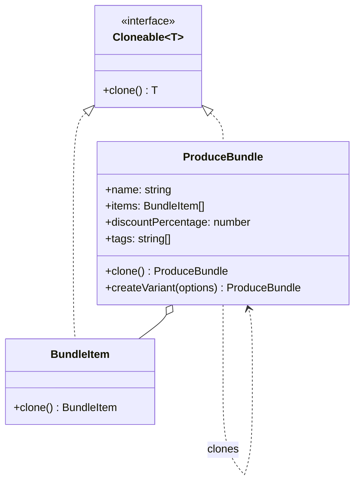

## Slide 15: Prototype - Benefits & Use Cases
- **Benefits**:
  - Reduces subclassing
  - Avoids costly creation operations
  - Provides alternative to factory pattern
- **When to Use**:
  - When classes to instantiate are specified at runtime
  - To avoid building a class hierarchy of factories
  - When creating objects similar to existing ones is more efficient

## Slide 16: Singleton Pattern
- **Problem**: Ensuring a class has only one instance
- **Solution**: Make class responsible for keeping track of its sole instance
- **Key Components**:
  - Private constructor
  - Static instance variable
  - Static access method

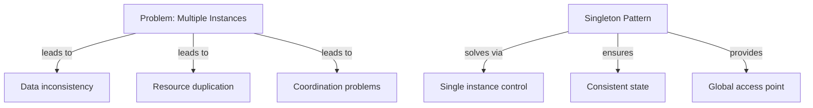

## Slide 17: Singleton - Example
```typescript
export class Inventory {
  // Static instance variable
  private static instance: Inventory | null = null;
  private items: Map<string, number>;
  private prices: Map<string, number>;

  // Private constructor prevents direct instantiation
  private constructor() {
    this.items = new Map<string, number>();
    this.prices = new Map<string, number>();
    console.log("Inventory system initialized");
  }

  // Static method to access single instance
  public static getInstance(): Inventory {
    if (!Inventory.instance) {
      Inventory.instance = new Inventory();
    }
    return Inventory.instance;
  }

  // Regular methods to operate on the singleton
  addItem(name: string, quantity: number, price: number): void {
    this.items.set(name, (this.items.get(name) || 0) + quantity);
    this.prices.set(name, price);
  }
}
```

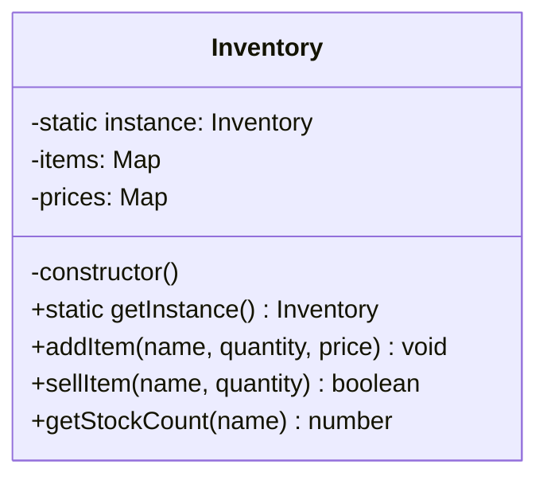

## Slide 18: Singleton - Benefits & Use Cases
- **Benefits**:
  - Controlled access to sole instance
  - Reduced namespace pollution
  - Allows refinement of operations and representation
- **When to Use**:
  - Exactly one instance needed (database connection, logging, caches)
  - Must be accessible from well-known access point
  - When the instance should be extensible by subclassing

## Slide 19: Comparing Creational Patterns
| Pattern | Main Purpose | Complexity | Flexibility |
|---------|-------------|------------|------------|
| Factory Method | Create objects through inheritance | Low | Medium |
| Abstract Factory | Create families of related objects | Medium | High |
| Builder | Construct complex objects step by step | Medium | High |
| Prototype | Create objects by cloning | Low | Medium |
| Singleton | Ensure a single instance | Low | Low |

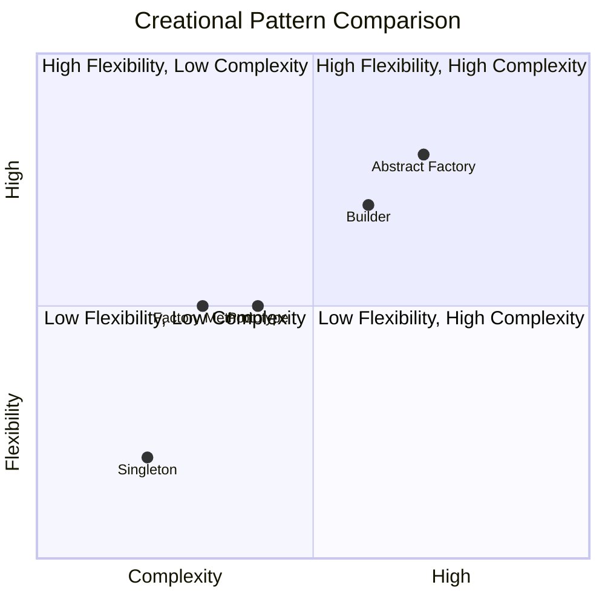

## Slide 20: Best Practices
- Choose the right pattern for your specific needs:
  - **Factory Method**: When you don't know exact types in advance
  - **Abstract Factory**: When working with families of related objects
  - **Builder**: When dealing with complex objects with many parameters
  - **Prototype**: When object creation is expensive or complex
  - **Singleton**: When exactly one instance is needed
- Consider combining patterns for more complex solutions
- Document your pattern usage for team understanding

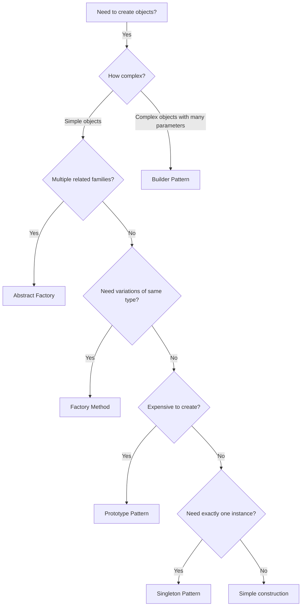

## Slide 21: Common Anti-patterns
- Overusing Singleton (global state problems)
- Creating complex hierarchies with Factory patterns
- Overengineering simple object creation
- Not respecting immutability when using Builder
- Using Prototype when simple object creation would suffice

## Slide 22: Real-world Applications
- **Java**: `java.util.Calendar#getInstance()`
- **JavaScript**: jQuery's `$()` function (Factory)
- **React**: Component creation is Factory-like
- **Angular**: Services are Singletons by default
- **Spring Framework**: Bean creation is Abstract Factory-like
- **GUI Builders**: Use Builder pattern extensively

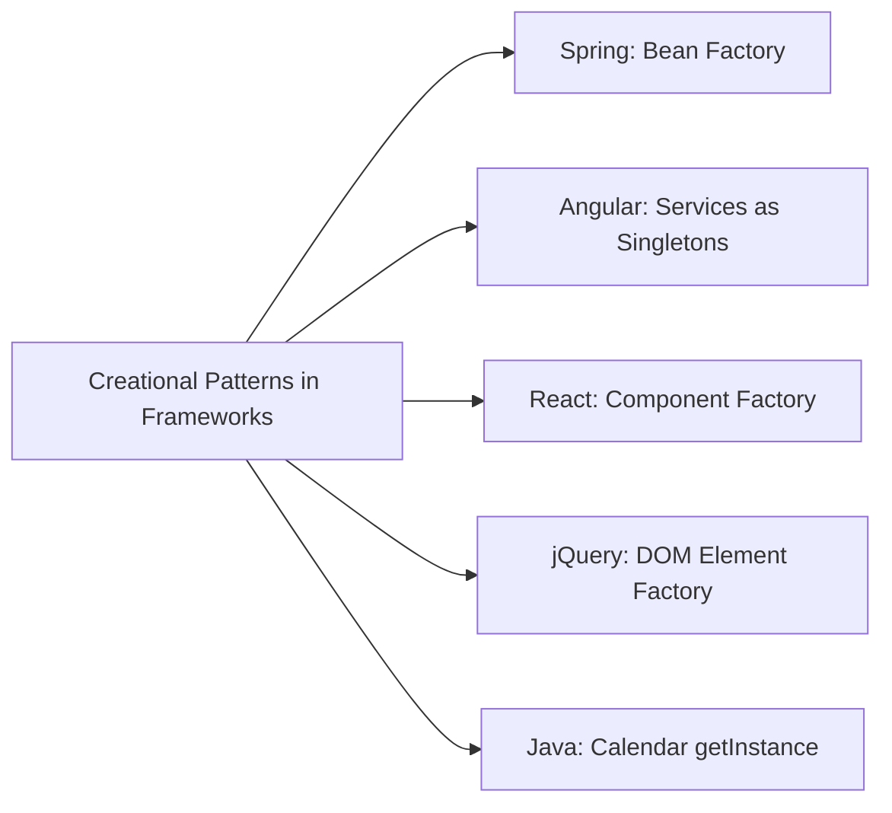

## Slide 23: Questions & Discussion
- What creational patterns are you currently using?
- Which pattern might solve your current design challenges?
- How might you refactor existing code to better use creational patterns?
- Any challenges implementing these patterns in your codebase?

## Slide 24: Resources
- Design Patterns: Elements of Reusable Object-Oriented Software (Gang of Four)
- Head First Design Patterns
- Refactoring Guru: https://refactoring.guru/design-patterns/creational-patterns
- GitHub repository for this presentation: [Your Repository URL]
- Contact: [Your Contact Information]