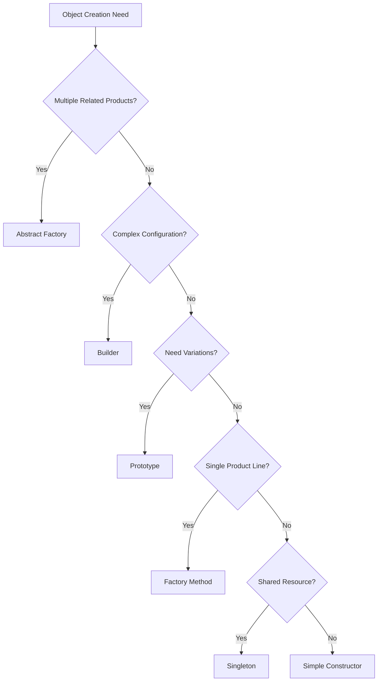
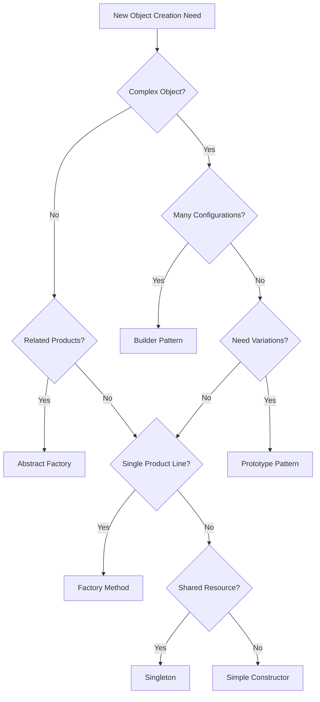

# Deep Dive into Creational Patterns

## Slide 1: Title Slide
### Deep Dive into Creational Patterns
#### Understanding Design Patterns Through Real-World Examples
[Ahmad Muzaki]
[Frontend Developer]
[2025]

## Slide 2: Introduction
### The Challenge of Object Creation
- **Common Problems in Software Development**:
  - Complex object initialization
  - Tight coupling between components
  - Inconsistent object creation
  - Hard-to-maintain code
- **The Role of Creational Patterns**:
  - Structured approach to object creation
  - Flexibility in instantiation process
  - System independence from creation details
  - Better code organization and maintenance

## Slide 3: Pattern Overview and Selection Guide
### When to Use Each Pattern:
- **Factory Method**: Single product line, extensible through inheritance
  - *Example*: Different types of produce (leafy greens, root vegetables)
- **Abstract Factory**: Families of related products
  - *Example*: Organic vs. conventional produce with matching packaging
- **Builder**: Complex objects with many configurations
  - *Example*: Customizable produce packages with multiple options
- **Prototype**: Object cloning and variations
  - *Example*: Seasonal produce bundles based on existing templates
- **Singleton**: Global state and resource management
  - *Example*: Centralized inventory system



## Slide 4: Factory Method Deep Dive
### Real-World Scenario: Produce Management System

#### The Problem
- Store needs to handle different types of produce
- Each type has unique characteristics
- Need standardized creation process
- Support for organic variants

```typescript
// Before Factory Method - Problematic Approach
class ProduceManager {
    createProduce(type: string, name: string, price: number, organic: boolean) {
        switch(type) {
            case 'leafy':
                return new LeafyGreen(name, price, organic);
            case 'root':
                return new RootVegetable(name, price, organic);
            // More cases = More complexity
        }
    }
}
```

#### The Solution
```typescript
// Abstract base classes
abstract class Produce {
    constructor(
        public readonly name: string,
        public readonly price: number,
        public readonly category: string,
        public readonly organic: boolean = false
    ) {}
    abstract getDescription(): string;
}

// Factory Method pattern
abstract class ProduceFactory {
    abstract createProduce(name: string, price: number, organic: boolean): Produce;
    
    getProduce(name: string, price: number, organic: boolean = false): Produce {
        const produce = this.createProduce(name, price, organic);
        console.log(`Created: ${produce.getDescription()}`);
        return produce;
    }
}
```

#### Implementation Success
```typescript
// Concrete implementation
class LeafyGreenFactory extends ProduceFactory {
    createProduce(name: string, price: number, organic: boolean): Produce {
        return new LeafyGreen(name, price, 'leafy green', organic);
    }
}

// Usage with clear benefits
const department = new ProduceDepartment();
const organicSpinach = department.addNewProduce('leafy', 'Spinach', 3.99, true);
const regularCarrot = department.addNewProduce('root', 'Carrot', 1.99, false);
```

## Slide 5: Abstract Factory In Action
### Real-World Scenario: Organic Product Line

#### The Challenge
- Need to ensure consistent product families
- Organic produce requires eco-friendly packaging
- Multiple product types must work together
- Different standards for organic vs conventional

```typescript
// Product interfaces
interface Fruit {
    getType(): string;
    getPrice(): number;
    planting(): string;
    getDescription(): string;
}

interface Packaging {
    getMaterial(): string;
    isRecyclable(): boolean;
    getDescription(): string;
    getCost(): number;
}

// Abstract Factory interface
interface FruitFactory {
    createApple(): Apple;
    createMelon(): Melon;
    createFruitBox(): FruitBox;
    createGiftWrapping(): GiftWrapping;
}
```

#### Practical Implementation
```typescript
class OrganicFruitFactory implements FruitFactory {
    createApple(): Apple {
        return new OrganicApple(); // Uses organic methods
    }
    createMelon(): Melon {
        return new OrganicMelon(); // Uses organic methods
    }
    createFruitBox(): FruitBox {
        return new OrganicFruitBox(); // Uses compostable materials
    }
    createGiftWrapping(): GiftWrapping {
        return new OrganicGiftWrapping(); // Uses recycled materials
    }
}

// Usage in a gift shop context
class GiftShop {
    constructor(private factory: FruitFactory) {}
    
    createGiftBasket(): GiftBasket {
        return {
            fruits: [
                this.factory.createApple(),
                this.factory.createMelon()
            ],
            box: this.factory.createFruitBox(),
            wrapping: this.factory.createGiftWrapping()
        };
    }
}
```

## Slide 6: Builder Pattern Showcase
### Real-World Scenario: Custom Produce Packages

#### The Problem
- Complex package configuration
- Many optional components
- Need for validation
- Different package types

```typescript
// Core package structure
class ProducePackage {
    name: string;
    fruits: string[];
    vegetables: string[];
    totalItems: number;
    price: number;
    isGift: boolean;
    hasDiscount: boolean;
    discountPercent: number;
    recyclablePackaging: boolean;
    customMessage: string;
    deliveryDate: Date | null;
}

// Builder implementation
class ProducePackageBuilder {
    withFruits(fruits: string[]): ProducePackageBuilder {
        this.fruits = [...fruits];
        return this;
    }

    withPrice(price: number): ProducePackageBuilder {
        if (price < 0) throw new Error("Price cannot be negative");
        this.price = price;
        return this;
    }

    build(): ProducePackage {
        if (this.name.trim().length === 0) {
            throw new Error("Package name cannot be empty");
        }
        return new ProducePackage(this);
    }
}
```

#### Real-World Usage
```typescript
// Holiday package creation
const holidayPackage = ProducePackage.builder("Holiday Special")
    .withFruits(["Apple", "Pear", "Orange"])
    .withVegetables(["Spinach"])
    .withPrice(29.99)
    .asGift()
    .withDiscount(10)
    .withCustomMessage("Happy Holidays!")
    .withDeliveryDate(new Date("2023-12-25"))
    .build();

// Dynamic assembly
class PackageAssembler {
    createWeeklyPackage(week: number): ProducePackage {
        const builder = ProducePackage.builder(`Week ${week} Bundle`);
        
        // Base configuration
        builder.withPrice(19.99)
              .withRecyclablePackaging();
        
        // Season-specific items
        if (this.isSummerSeason()) {
            builder.withFruits(["Watermelon", "Peach", "Plum"]);
        } else {
            builder.withFruits(["Apple", "Orange", "Pear"]);
        }
        
        return builder.build();
    }
}
```

## Slide 7: Prototype Pattern in Practice
### Real-World Scenario: Bundle Management

#### The Challenge
- Need efficient bundle variations
- Complex object copying
- Seasonal adaptations
- Promotional variants

```typescript
// Core components
interface Cloneable<T> {
    clone(): T;
}

class ProduceBundle implements Cloneable<ProduceBundle> {
    constructor(
        public name: string,
        public items: Array<BundleItem>,
        public discountPercentage: number = 0,
        public tags: string[] = []
    ) {}
    
    clone(): ProduceBundle {
        const clonedItems = this.items.map(item => item.clone());
        return new ProduceBundle(
            this.name,
            clonedItems,
            this.discountPercentage,
            [...this.tags]
        );
    }
    
    createVariant(options: Partial<ProduceBundle>): ProduceBundle {
        const clone = this.clone();
        Object.assign(clone, options);
        return clone;
    }
}
```

#### Practical Applications
```typescript
// Base bundle creation
const weekdayBundle = new ProduceBundle(
    "Weekday Mix",
    [
        new BundleItem("Carrot", 1.99, 5),
        new BundleItem("Apple", 0.99, 3),
        new BundleItem("Kale", 4.50, 1)
    ],
    10,
    ["popular", "healthy"]
);

// Quick variant creation
const flashSaleBundle = weekdayBundle.createVariant({
    name: "Flash Sale Bundle",
    discountPercentage: 25,
    tags: [...weekdayBundle.tags, "flash-sale"]
});

// Premium variant
const premiumBundle = weekdayBundle.createVariant({
    name: "Premium Selection",
    items: weekdayBundle.items.map(item => {
        const premium = item.clone();
        premium.organic = true;
        return premium;
    }),
    tags: [...weekdayBundle.tags, "premium", "organic"]
});
```

## Slide 8: Singleton Pattern Implementation
### Real-World Scenario: Inventory Management

#### The Problem
- Multiple systems accessing inventory
- Data consistency requirements
- Resource efficiency needs
- Centralized control

```typescript
class Inventory {
    private static instance: Inventory | null = null;
    private items: Map<string, number>;
    private prices: Map<string, number>;

    private constructor() {
        this.items = new Map<string, number>();
        this.prices = new Map<string, number>();
    }

    public static getInstance(): Inventory {
        if (!Inventory.instance) {
            Inventory.instance = new Inventory();
        }
        return Inventory.instance;
    }
}
```

#### Real-World Usage
```typescript
// Multiple access points using same instance
const terminal1 = Inventory.getInstance();
terminal1.sellItem("Apple", 5);

const terminal2 = Inventory.getInstance();
console.log(terminal2.getStockCount("Apple")); // Correctly shows updated count

// Stock management
const stockroom = Inventory.getInstance();
stockroom.addItem("Orange", 100, 0.99);

const onlineStore = Inventory.getInstance();
console.log(onlineStore.getStockCount("Orange")); // Shows 100
```

## Slide 9: Advanced Pattern Combinations
### Real-World Examples

1. **Factory + Builder**
```typescript
abstract class PackageFactory {
    abstract createBuilder(): ProducePackageBuilder;
    
    createPackage(name: string): ProducePackage {
        return this.createBuilder()
            .withName(name)
            .withDefaultItems()
            .build();
    }
}
```

2. **Abstract Factory + Prototype**
```typescript
class SeasonalFruitFactory implements FruitFactory {
    constructor(private baseFactory: FruitFactory) {}
    
    createApple(): Apple {
        const base = this.baseFactory.createApple();
        return this.addSeasonalFeatures(base.clone());
    }
}
```

3. **Builder + Singleton**
```typescript
class GlobalPackageBuilder {
    private static instance: GlobalPackageBuilder;
    private constructor() {}
    
    static getInstance(): GlobalPackageBuilder {
        if (!GlobalPackageBuilder.instance) {
            GlobalPackageBuilder.instance = new GlobalPackageBuilder();
        }
        return GlobalPackageBuilder.instance;
    }
}
```

## Slide 10: Best Practices & Anti-patterns
### Making the Right Choices

#### Best Practices
1. **Pattern Selection**
   - Choose based on specific needs
   - Consider maintenance implications
   - Think about future extensions

2. **Implementation Guidelines**
   - Keep interfaces clean and focused
   - Use meaningful names
   - Document pattern usage

3. **Testing Considerations**
   - Test pattern behaviors
   - Verify object relationships
   - Check edge cases

#### Common Anti-patterns
1. **Pattern Misuse**
   - Overusing Singleton
   - Complex factory hierarchies
   - Unnecessary abstraction

2. **Implementation Issues**
   - Tight coupling
   - Poor encapsulation
   - Inconsistent interfaces

## Slide 11: Pattern Selection Guide
### Decision Framework



## Slide 12: Real-World Applications
### Framework Examples

- **React**: Component Factories
- **Angular**: Services as Singletons
- **Vue**: Plugin System (Factory Method)
- **Express**: Middleware Builder
- **Spring**: Bean Factory
- **Django**: Form Builders

## Slide 13: Case Studies
### Success Stories

1. **E-commerce Platform**
   - Builder for Order Creation
   - Factory Method for Payment Processing
   - Singleton for Shopping Cart

2. **Content Management System**
   - Abstract Factory for Theme Components
   - Prototype for Template Cloning
   - Builder for Page Construction

3. **Inventory System**
   - Singleton for Inventory Management
   - Factory Method for Product Categories
   - Builder for Complex Reports

## Slide 14: Implementation Tips
### Practical Advice

1. **Code Organization**
   - Clear folder structure
   - Consistent naming
   - Pattern documentation

2. **Performance Considerations**
   - Lazy initialization
   - Resource management
   - Memory usage

3. **Maintenance Strategy**
   - Pattern evolution
   - Version compatibility
   - Team training

## Slide 15: Future Trends
### Evolution of Patterns

1. **Modern JavaScript/TypeScript**
   - Decorators
   - Static typing
   - Module systems

2. **Framework Integration**
   - Built-in pattern support
   - Custom implementations
   - Hybrid approaches

3. **Cloud Native Patterns**
   - Distributed patterns
   - Containerization
   - Microservices

## Slide 16: Resources
### Further Learning

1. **Books**
   - "Design Patterns" (Gang of Four)
   - "Head First Design Patterns"
   - "Patterns of Enterprise Application Architecture"

2. **Online Resources**
   - RefactoringGuru
   - SourceMaking
   - Pattern-oriented Software Architecture

3. **Community**
   - Stack Overflow
   - GitHub Discussions
   - Developer Forums

## Questions & Discussion
- Pattern selection scenarios
- Implementation challenges
- Best practices
- Real-world applications

## Contact Information
[Your Contact Details]
[Repository Links]
[Additional Resources]